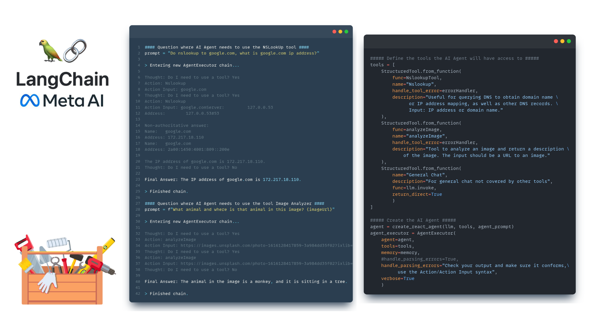

# Generative AI - Agent
## Creates an AI Agent that can access various custom tools.

<!--
*** Written by Martin Karlsson
*** www.martinkarlsson.io
-->

[![LinkedIn][linkedin-shield]][linkedin-url]

<!-- ABOUT THE PROJECT -->
## About The Project

Intention with this project is to provide a boilerplate for an AI Agent with custom made tools in a toolbox.
It's an orchestration of multiple functions and models - controlled and integrated with one umbrella AI Agent. 
In this example an AI Agent uses functions that allows it to do IP lookup and interact with an image analyzer ML model.
The AI Agent is fully autonomous in it's reasoning when it should use the tools or not - impressive!

 

##### Tech Stack
<ul>
<li>LangChain [ https://www.langchain.com/ ]</li>
<li>Ollama [ https://ollama.com/ ]</li>
<li>Meta AI [ https://ai.meta.com/blog/code-llama-large-language-model-coding/ ]</li>
</ul>

### Start
On a Linux machine you can install Ollama with following command:
``
bash ollama.sh
``
On Windows & Mac please go to [Ollama](https://ollama.com/) and follow the instructions.

Install pip requirements with following command:
``
pip install -r requirements.txt
``

Start the AI Agent with following command:
``
python main.py
``

<!-- CONTACT -->
## Contact

### Martin Karlsson

LinkedIn : [martin-karlsson][linkedin-url] \
Twitter : [@HelloKarlsson](https://twitter.com/HelloKarlsson) \
Email : hello@martinkarlsson.io \
Webpage : [www.martinkarlsson.io](https://www.martinkarlsson.io)

Project Link: [github.com/martinkarlssonio/genai-agent](https://github.com/martinkarlssonio/genai-agent)

<!-- MARKDOWN LINKS & IMAGES -->
[linkedin-shield]: https://img.shields.io/badge/-LinkedIn-black.svg?style=for-the-badge&logo=linkedin&colorB=555
[linkedin-url]: https://linkedin.com/in/martin-karlsson